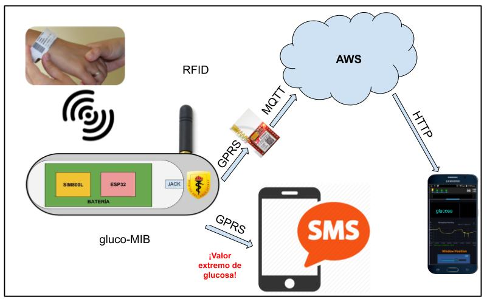
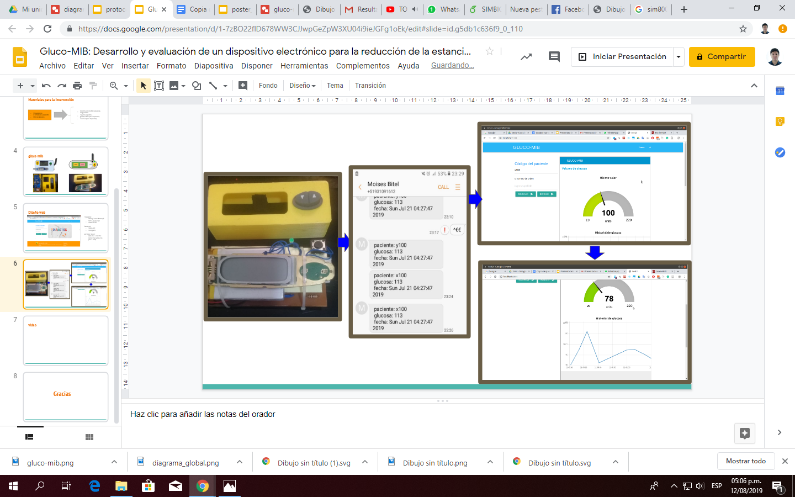

## GLUCO-MIB: DESARROLLO Y EVALUACIÓN DE LA USABILIDAD Y FACTIBILIDAD DE UN SISTEMA DE INTERNET DE LAS COSAS PARA EL MONITOREO DE GLICEMIA EN PACIENTES HOSPITALIZADOS CON DIABETES MELLITUS TIPO 2 

_La diabetes mellitus (DM) es una enfermedad crónica que se caracteriza principalmente por los altos niveles de glucosa en sangre. La prevalencia de DM se incremento de 4.7% en 1980 a 8.5% en 2014 a nivel global.
Los problemas cardiovasculares, las infecciones y la hiperglicemia son causas de hospitalización de diabéticos, siendo las infecciones las principales causas de mortalidad en los hospitales públicos peruanos.
_

## Comenzando 🚀

_Estas instrucciones te permitirán obtener una copia del proyecto en funcionamiento en tu máquina local para propósitos de desarrollo y pruebas._

Mira **Deployment** para conocer como desplegar el proyecto.

###  Introducción 📋

_Objetivo general:_

_Desarrollar y evaluar la usabilidad y la factibilidad del sistema IoT de monitoreo de glicemia de pacientes hospitalizados con diabetes tipo 2 centrado en profesionales de la salud._

_Objetivos específicos:_

* Identificar las características del dispositivo requeridas por el personal de salud para el control de la glicemia de los pacientes diabéticos. 
* Desarrollar un sistema IoT de monitoreo de glicemia de acuerdo a las necesidades identificadas.
* Evaluar la usabilidad centrada en el personal de salud del sistema IoT de control de glicemia.
* Evaluar la factibilidad centrada en el personal de salud del sistema IoT de control de glicemia.

### Materiales y métodos 🔧

_Se recolectarán las necesidades utilizando métodos cualitativos mediante grupos focales. Luego del desarrollo de la aplicación se evaluará la usabilidad y la factibilidad del sistema de monitoreo remoto de glucosa_

### Parte Técnologica 🔧
_Usaremos un esp32 para obtener la data de glucosa y lo enviaremos a una RaspberryPI que hará la función de servidor, ademas mostarar un web donde se podra generar reportes de glucosa durante el día_

